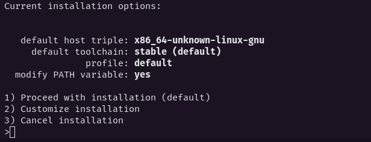

# Installing Rust on Fedora 34

To install Rust on Fedora 34 is very simple. You can install using rustup, with the command to download the official compiler for the Rust, and its package manager, Cargo.

```bash 
curl --proto '=https' --tlsv1.2 -sSf https://sh.rustup.rs | sh
```
At this point, you can select the default option (1)



Will be installed the rustc, cargo, clippy, rust-docs, rust-std, rustfmt. Now, you can run


```bash 
source $HOME/.cargo/env
```

to configure the current shell.

To check the versions of rustc and cargo, run:

```bash 
rustc --version
```
and

```bash 
cargo --version
```
